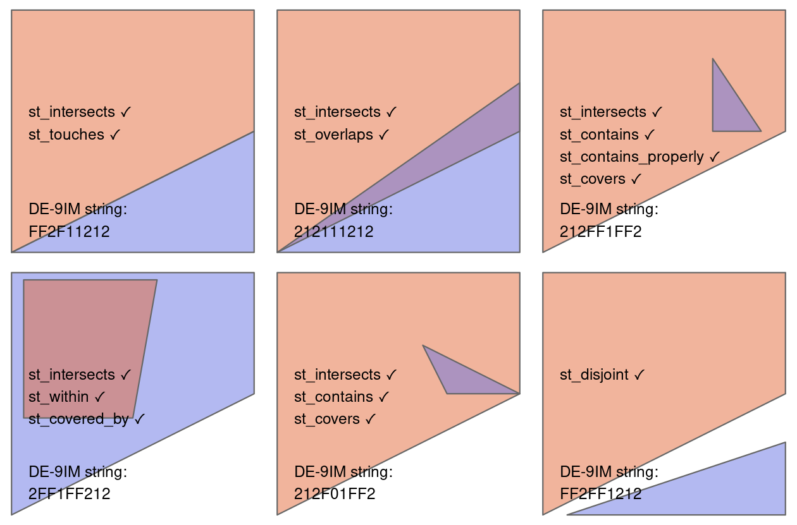
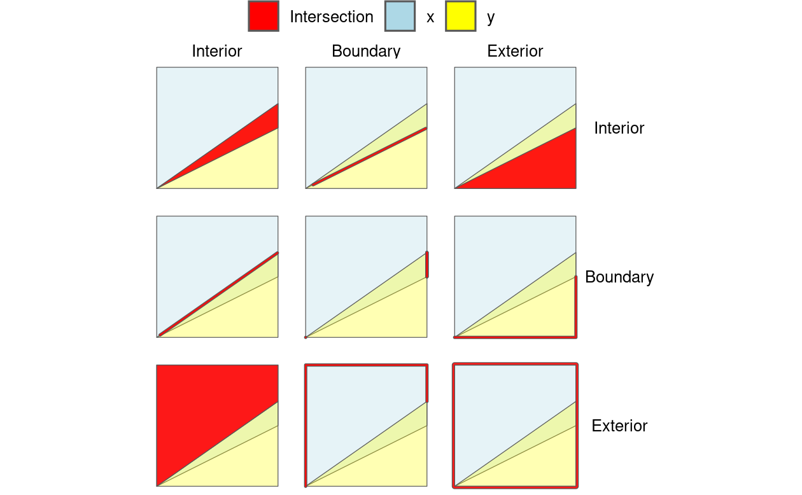
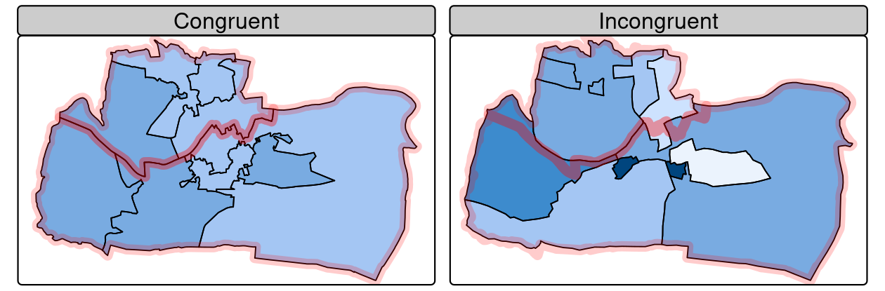

# Spatial data operations

```{r message=FALSE}
library(sf)
library(terra)
library(dplyr)
library(spData)
```

# Spatial operations on vector data

> for `sf` package/vector data

## Spatial subsetting

Subsets of `sf` data frames can be created with square bracket (`[`) operator using the syntax:

`x[y, , op = st_intersects]`

:   `x` is an `sf` object from which a subset of rows will be returned

    `y` is the ‘subsetting object’

    `op = st_intersects` is an optional argument that specifies the topological relation (also known as the binary predicate) used to do the subsetting. The default topological relation used when an `op` argument is not provided is [`st_intersects()`](https://r-spatial.github.io/sf/reference/geos_binary_pred.html)

The [`filter()`](https://dplyr.tidyverse.org/reference/filter.html) function from the **tidyverse** can also be used but this approach is more verbose, as we will see in the examples below.

To demonstrate spatial subsetting, we will use the `nz` and `nz_height` datasets in the **spData** package, which contain geographic data on the 16 main regions and 101 highest points in New Zealand, respectively (Figure [4.1](https://r.geocompx.org/spatial-operations#fig:nz-subset)), in a projected coordinate reference system. The following code chunk creates an object representing Canterbury, then uses spatial subsetting to return all high points in the region.

```{r}
canterbury <-  nz |> filter(Name == "Canterbury")
canterbury_height <- nz_height[canterbury, ]
```

```{r}
class(canterbury_height)
```

```{r}
library(tmap)
p_hpnz1 = tm_shape(nz) + 
  tm_polygons(fill = "white") +
  tm_shape(nz_height) + 
  tm_symbols(shape = 2, col = "red", size = 0.5, col_alpha = 0.75) +
  tm_title("High points in New Zealand") +
  tm_layout(bg.color = "lightblue")
p_hpnz2 = tm_shape(nz) + 
  tm_polygons(fill = "white") +
  tm_shape(canterbury) +
  tm_fill(col = "gray") + 
  tm_shape(canterbury_height) + 
  tm_symbols(shape = 2, col = "red", size = 0.5, col_alpha = 0.75) +
  tm_title("High points in Canterbury") +
  tm_layout(bg.color = "lightblue")
tmap_arrange(p_hpnz1, p_hpnz2, ncol = 2)
```

```{r}
names(nz)
```

```{r}
names(nz_height)
```

```{r}
nz_height[1,]
```

```{r}
class(nz)
class(nz_height)
```

Various *topological relations* can be used for spatial subsetting which determine the type of spatial relationship that features in the target object must have with the subsetting object to be selected. These include *touches*, *crosses* or *within.* The default setting `st_intersects` is a ‘catch all’ topological relation that will return features in the target that *touch*, *cross* or are *within* the source ‘subsetting’ object.

```{r}
nz_height[canterbury, , op = st_disjoint]
```

Subsetting with objects returned by operators

```{r}
sel_sgbp <- st_intersects(x = nz_height, y = canterbury)
class(sel_sgbp)
sel_sgbp
```

```{r}
sel_logical <- lengths(sel_sgbp) > 0
canterbury_height2 <- nz_height[sel_logical,]
```

Alternatively:

```{r}
canterbury_height3 <- nz_height |> 
  st_filter(y = canterbury, .predicate = st_intersects)
```

```{r}
str(canterbury_height2)
str(canterbury_height3)
```

## Topological relations

> Binary



```{r}
polygon_matrix <- cbind(
  x = c(0, 0, 1, 1, 0),
  y = c(0, 1, 1, 0.5, 0)
)
polygon_sfc <-  st_sfc(st_polygon(list(polygon_matrix)))
```

```{r}
str(polygon_sfc)
```

```{r}
line_sfc <- st_sfc(st_linestring(cbind(
  x = c(0.4, 1),
  y = c(0.2, 0.5)
)))
point_df <- data.frame(
  x = c(0.2, 0.7, 0.4),
  y = c(0.1, 0.2, 0.8)
)
point_sf <- st_as_sf(point_df, coords = c("x","y"))
```

```{r}
par(pty = "s")
plot(polygon_sfc, border = "red", col = "gray", axes = TRUE)
plot(line_sfc, lwd = 5, add = TRUE)
plot(point_sf, add = TRUE, lab = 1:4, cex = 2)
text(point_df[, 1] + 0.02, point_df[, 2] + 0.04, 1:3, cex = 1.3)
```

```{r}
st_intersects(point_sf, polygon_sfc)
```

```{r}
st_intersects(point_sf, polygon_sfc, sparse = FALSE)
```

```{r}
st_within(point_sf, polygon_sfc)
st_touches(point_sf, polygon_sfc)
```

```{r}
st_disjoint(point_sf, polygon_sfc, sparse = FALSE)[, 1]
```

(note `[, 1]` converts the result into a vector)

```{r}
st_is_within_distance(point_sf, polygon_sfc, dist = 0.2, sparse = FALSE)[, 1]
```

## Distance relations

> Continuous

```{r}
nz_highest <- nz_height |> slice_max(n = 1, order_by = elevation)
canterbury_centroid = st_centroid(canterbury)
st_distance(nz_highest, canterbury_centroid)
```

There are two potentially surprising things about the result:

-   It has `units`, telling us the distance is 100,000 meters, not 100,000 inches, or any other measure of distance

-   It is returned as a matrix, even though the result only contains a single value

Find the distances between the first three features in `nz_height` and the Otago and Canterbury regions of New Zealand represented by the object `co`.

```{r}
co <- filter(nz, grepl("Canter|Otag", Name))
st_distance(nz_height[1:3, ], co)
```

The second and third features are actually in Otag.

```{r}
plot(st_geometry(co)[2])
plot(st_geometry(nz_height)[2:3], add = TRUE)
```

## DE-91M strings



|              | Interior (x) | Boundary (x) | Exterior (x) |
|:-------------|:-------------|:-------------|:-------------|
| Interior (y) | 2            | 1            | 2            |
| Boundary (y) | 1            | 1            | 1            |
| Exterior (y) | 2            | 1            | 2            |

Dimensions: 0 (points), 1 (lines), and 2 (polygons)

Flattening results in the string "212111212".

```{r}
source("../code/de_9im.R")
library(sf)
xy2sfc = function(x, y) st_sfc(st_polygon(list(cbind(x, y))))
p1 = xy2sfc(x = c(0, 0, 1, 1,   0), y = c(0, 1, 1, 0.5, 0))
p2 = xy2sfc(x = c(0, 1, 1, 0), y = c(0, 0, 0.5, 0))
p3 = xy2sfc(x = c(0, 1, 1, 0), y = c(0, 0, 0.7, 0))
p4 = xy2sfc(x = c(0.7, 0.7, 0.9, 0.7), y = c(0.8, 0.5, 0.5, 0.8))
p5 = xy2sfc(x = c(0.6, 0.7, 1, 0.6), y = c(0.7, 0.5, 0.5, 0.7))
p6 = xy2sfc(x = c(0.1, 1, 1, 0.1), y = c(0, 0, 0.3, 0))
p7 = xy2sfc(x = c(0.05, 0.05, 0.6, 0.5, 0.05), y = c(0.4, 0.97, 0.97, 0.4, 0.4))

# todo: add 3 more with line/point relations?
tmap::tmap_arrange(de_9im(p1, p2), de_9im(p1, p3), de_9im(p1, p4),
                   de_9im(p7, p1), de_9im(p1, p5), de_9im(p1, p6), nrow = 2)

```

```{r}
st_relate(p1, p4)
```

```{r}
st_queen <- function(x, y) st_relate(x, y, pattern = "F***T****")
st_rook <- function(x, y) st_relate(x, y, pattern = "F***1****")
```

```{r}
x <- p1
y <- p4
grid <- st_make_grid(x, n = 3)
grid_sf <- st_sf(grid)
```

```{r}
class(grid_sf$grid)
```

```{r}
grid_sf$queens <- lengths(st_queen(grid, grid[5])) > 0
plot(grid, col = grid_sf$queens)
grid_sf$rooks <- lengths(st_rook(grid, grid[5])) > 0
plot(grid, col = grid_sf$rooks)
```

```{r}
grid_sf$rooks
```

## Spatial joining

The process is illustrated by the following example: imagine you have ten points randomly distributed across the Earth’s surface and you ask, for the points that are on land, which countries are they in? Implementing this idea in a [reproducible example](https://github.com/geocompx/geocompr/blob/main/code/04-spatial-join.R) will build your geographic data handling skills and show how spatial joins work. The starting point is to create points that are randomly scattered over the Earth’s surface.

```{r}
(bb = st_bbox(world))
```

```{r}
set.seed(2018)
random_df <- data.frame(
  x = runif(n = 10, min = bb[1], max = bb[3]),
  y = runif(n = 10, min = bb[2], max = bb[4])
)
random_points = random_df |> 
  st_as_sf(coords = c("x", "y"), crs = "EPSG:4326") 
```

```{r}
world_random <- world[random_points, ]
nrow(world_random)
```

```{r}
random_joined <- st_join(random_points, world["name_long"])
```

```{r}
random_joined$name_long = as.character(random_joined$name_long)

jm0 = tm_shape(world) + tm_borders(lwd = 0.2) + tm_format("World")

jm1 = jm0 +
  tm_shape(shp = random_points, bbox = bb) +
  tm_symbols(col = "black", shape = 4, lwd = 3)

jm2 = jm0 +
  tm_shape(world_random, bbox = bb) +
  tm_fill(fill = "name_long", fill.scale = tm_scale(values = "Dark2")) +
  tm_layout(legend.show = FALSE)

jm3 = jm0 +
  tm_shape(shp = random_joined, bbox = bb) +
  tm_symbols(col = "name_long", shape = 4, lwd = 3, col.scale = tm_scale(values = "Dark2")) +
  tm_layout(legend.show = FALSE)

jm4 = jm0 +
  tm_shape(shp = random_joined, bbox = bb) +
  tm_symbols(col = "name_long", shape = 4, lwd = 3, col.scale = tm_scale(values = "Dark2")) +
  tm_layout(legend.only = TRUE)

tmap_arrange(jm1, jm2, jm3, jm4, nrow = 2, ncol = 2)
```

## Distance based joins

Sometimes two geographic datasets do not intersect but still have a strong geographic relationship due to their proximity. The datasets `cycle_hire` and `cycle_hire_osm`, already attached in the **spData** package, provide a good example. Plotting them shows that they are often closely related but they do not touch, as shown in Figure [4.7](https://r.geocompx.org/spatial-operations#fig:cycle-hire), a base version of which is created with the following code below:

```{r}
plot(st_geometry(cycle_hire), col = "blue")
plot(st_geometry(cycle_hire_osm), add = TRUE, pch = 3, col = "red")
```

```{r}
any(st_intersects(cycle_hire, cycle_hire_osm, sparse = FALSE))
```

alternatively

```{r}
sum(st_geometry(cycle_hire) %in% st_geometry(cycle_hire_osm))
sum(st_coordinates(cycle_hire)[, 1] %in% st_coordinates(cycle_hire_osm)[, 1])
```

```{r}
library(leaflet)
  leaflet() |>
    # addProviderTiles(providers$OpenStreetMap.BlackAndWhite) |>
    addCircles(data = cycle_hire) |>
    addCircles(data = cycle_hire_osm, col = "red")
```

```{r}
str(cycle_hire_osm)
```

```{r}
str(cycle_hire)
```

Imagine that we need to join the `capacity` variable in `cycle_hire_osm` onto the official ‘target’ data contained in `cycle_hire`. This is when a non-overlapping join is needed. The simplest method is to use the binary predicate [`st_is_within_distance()`](https://r-spatial.github.io/sf/reference/geos_binary_pred.html), as demonstrated below using a threshold distance of 20 m. One can set the threshold distance in metric units also for unprojected data (e.g., lon/lat CRSs such as WGS84), if the spherical geometry engine (S2) is enabled, as it is in **sf** by default (see Section [2.2.9](https://r.geocompx.org/spatial-class#s2)).

```{r}
sel <- st_is_within_distance(cycle_hire, cycle_hire_osm,
                             dist = units::set_units(20, "m"))
summary(lengths(sel) > 0)
```

This shows that there are 438 points in the target object `cycle_hire` within the threshold distance of `cycle_hire_osm`. How to retrieve the *values* associated with the respective `cycle_hire_osm` points? The solution is again with [`st_join()`](https://r-spatial.github.io/sf/reference/st_join.html), but with an additional `dist` argument (set to 20 m below):

```{r}
z <- st_join(cycle_hire, cycle_hire_osm, st_is_within_distance,
             dist = units::set_units(20, "m"))
nrow(cycle_hire)
nrow(z)
```

The increased number of rows is because x matches more than one y. So aggregate

```{r}
z <- z |> 
  group_by(id) |> 
  summarise(capacity = mean(capacity))
nrow(z) == nrow(cycle_hire)
```

```{r}
plot(cycle_hire_osm["capacity"])
```

```{r}
plot(z["capacity"])
```

## Spatial aggregation

Returning to the example of New Zealand, imagine you want to find out the average height of high points in each region: it is the geometry of the source (`y` or `nz` in this case) that defines how values in the target object (`x` or `nz_height`) are grouped. This can be done in a single line of code with base R’s [`aggregate()`](https://rspatial.github.io/terra/reference/aggregate.html) method.

```{r}
nz_agg <- aggregate(x = nz_height, by = nz, FUN = mean)
str(nz_agg)
```

Alternatively

```{r}
nz_agg2 <- st_join(x = nz, y = nz_height) |> 
  group_by(Name) |> 
  summarise(elevation = mean(elevation, na.rm = TRUE))
str(nz_agg2)
```

```{r}
library(tmap)
tm_shape(nz_agg) +
  tm_fill("elevation", 
          fill.scale = tm_scale(breaks = seq(27, 30, by = 0.5) * 1e2)) +
  tm_borders() +
  tm_layout(scale = 1.8)
```

## Joining incongruent layers



The **spData** package contains a dataset named `incongruent` (colored polygons with black borders in the right panel of Figure [4.9](https://r.geocompx.org/spatial-operations#fig:areal-example)) and a dataset named `aggregating_zones` (the two polygons with the translucent blue border in the right panel of Figure [4.9](https://r.geocompx.org/spatial-operations#fig:areal-example)). Let us assume that the `value` column of `incongruent` refers to the total regional income in million Euros. How can we transfer the values of the underlying nine spatial polygons into the two polygons of `aggregating_zones`?

```{r}
iv <- incongruent["value"]
agg_aw <- st_interpolate_aw(iv, aggregating_zones, extensive = TRUE)
agg_aw$value
```

```{r}
str(incongruent)
```

```{r}
incongruent$value
```

```{r}
incongruent["value"]
```
