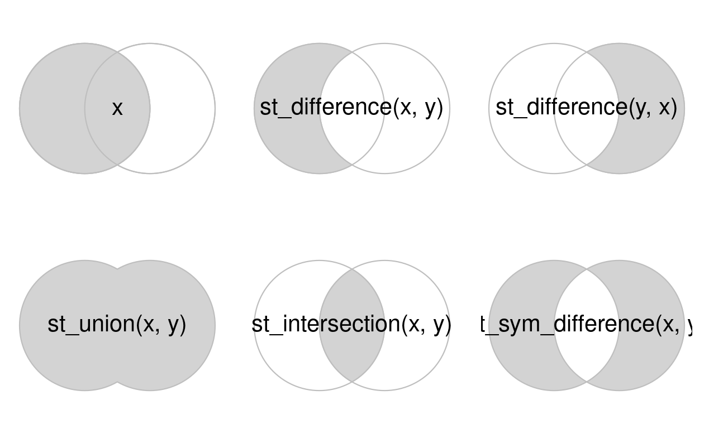

# Geometry operations

```{r message=FALSE}
library(sf)
library(terra)
library(dplyr)
library(spData)
library(spDataLarge)
```

# Geometric operations on vector data

## Simplification

```{r}
plot(seine)
seine_simp  <- st_simplify(seine, dTolerance = 2000)
plot(seine_simp)
```

```{r}
library(tmap)
p_simp1 = tm_shape(seine) + tm_lines() +
  tm_title("Original data")
p_simp2 = tm_shape(seine_simp) + tm_lines() +
  tm_title("st_simplify")
tmap_arrange(p_simp1, p_simp2, ncol = 2)
```

```{r}
object.size(seine)
object.size(seine_simp)
```

```{r}
us_states_simp1  <- st_simplify(us_states, dTolerance = 100000)
object.size(us_states)
object.size(us_states_simp1)
```

```{r}
us_states_simp2 = rmapshaper::ms_simplify(us_states, keep = 0.01,
                                          keep_shapes = TRUE)
us_states_simp3 = smoothr::smooth(us_states, method = "ksmooth", smoothness = 6)
```

```{r}
p_ussimp1 = tm_shape(us_states) + tm_polygons() + tm_title("Original data")
p_ussimp2 = tm_shape(us_states_simp1) + tm_polygons() + tm_title("st_simplify")
p_ussimp3 = tm_shape(us_states_simp2) + tm_polygons() + tm_title("ms_simplify")
p_ussimp4 = tm_shape(us_states_simp3) + tm_polygons() + tm_title('smooth(method = "ksmooth")')
tmap_arrange(p_ussimp1, p_ussimp2, p_ussimp3, p_ussimp4, ncol = 2, nrow = 2)
```

## Centroids

```{r}
nz_centroid <- st_centroid(nz)
seine_centroid <- st_centroid(seine)
```

```{r}
plot(nz_centroid)
```

```{r}
plot(nz_centroid["Name"])
```

```{r}
str(seine_centroid)
```

```{r}
nz_pos <- st_point_on_surface(nz)
seine_pos <- st_point_on_surface(seine)
```

```{r centr, warning=FALSE, echo=FALSE, fig.cap="Centroids (black points) and 'points on surface' (red points) of New Zealand's regions (left) and the Seine (right) datasets.", fig.scap="Centroid vs point on surface operations."}
p_centr1 = tm_shape(nz) + tm_polygons(col = "grey80", fill = "grey90") +
  tm_shape(nz_centroid) + tm_symbols(shape = 1, col = "black", size = 0.5) +
  tm_shape(nz_pos) + tm_symbols(shape = 1, col = "red", size = 0.5) +
  tm_layout(scale = 1.6)
p_centr2 = tm_shape(seine) + tm_lines(col = "grey80") +
  tm_shape(seine_centroid) + tm_symbols(shape = 1, col = "black", size = 0.5) +
  tm_shape(seine_pos) + tm_symbols(shape = 1, col = "red", size = 0.5) +
  tm_add_legend(type = "symbols", shape = 1, col = c("black", "red"), 
                labels = c("Centroid", "Point on surface")) +
  tm_layout(scale = 1.6)
tmap_arrange(p_centr1, p_centr2, ncol = 2)
```

## Buffers

```{r}
seine_buff_5km <- st_buffer(seine, dist = 5000)
seine_buff_50km <- st_buffer(seine, dist = 50000)
```

```{r buffs, echo=FALSE, fig.cap="Buffers around the Seine dataset of 5 km (left) and 50 km (right). Note the colors, which reflect the fact that one buffer is created per geometry feature.", fig.show='hold', out.width="100%", fig.scap="Buffers around the seine dataset."}
p_buffs1 = tm_shape(seine_buff_5km) + tm_polygons(fill =   "name") +
  tm_shape(seine) + tm_lines() +
  tm_title("5 km buffer") +
  tm_layout(legend.show = FALSE)
p_buffs2 = tm_shape(seine_buff_50km) + tm_polygons(fill =   "name") +
  tm_shape(seine) + tm_lines() +
  tm_title("50 km buffer") +
  tm_layout(legend.show = FALSE)
tmap_arrange(p_buffs1, p_buffs2, ncol = 2) 
```

The `st_buffer()` has a few additional arguments. The most important ones are:

-   `nQuadSegs` (when the GEOS\index{GEOS} engine is used), which means 'number of segments per quadrant' and is set by default to 30 (meaning circles created by buffers are composed of $4 \times 30 = 120$ lines). Unusual cases where it may be useful include when the memory consumed by the output of a buffer operation is a major concern (in which case it should be reduced) or when very high precision is needed (in which case it should be increased)
-   `max_cells` (when the S2\index{S2} engine is used), the larger the value, the more smooth the buffer will be, but the calculations will take longer
-   `endCapStyle` and `joinStyle` (when the GEOS engine is used), which control the appearance of the buffer's edges
-   `singleSide` (when the GEOS engine is used), which controls whether the buffer is created on one or both sides of the input geometry

```{r}
# Demonstrate nQuadSegs
seine_buff_simple = st_buffer(seine, dist = 50000, nQuadSegs = 3)
plot(seine_buff_simple, key.pos = NULL, main = "50 km buffer")
plot(seine, key.pos = NULL, lwd = 3, pal = rainbow, add = TRUE)
seine_points = st_cast(seine[1, ], "POINT")
buff_single = st_buffer(seine_points[1, ], 50000, 2)
buff_points = st_cast(buff_single, "POINT")
plot(st_geometry(buff_single), add = TRUE)
```

```{r}
seine_buff_simple = st_buffer(seine, dist = 50000, nQuadSegs = 3)
plot(seine_buff_simple, key.pos = NULL, main = "50 km buffer")
plot(seine, key.pos = NULL, lwd = 3, pal = rainbow, add = TRUE)
```

```{r}
plot(nz["Name"])
```

```         
seine_wgs = st_transform(seine, "EPSG:4326")
plot(st_buffer(seine, 5000))
plot(st_buffer(seine_wgs, 5000))
plot(st_buffer(seine, 5000, nQuadSegs = 1))
plot(st_buffer(seine_wgs, 5000, nQuadSegs = 1)) # no effect
plot(st_buffer(seine, 5000, max_cells = 10)) # no effect
plot(st_buffer(seine_wgs, 5000, max_cells = 100))
plot(st_buffer(seine, 5000, endCapStyle = "FLAT", joinStyle = "MITRE"))
plot(st_buffer(seine_wgs, 5000, endCapStyle = "FLAT", joinStyle = "MITRE")) # no effect
plot(st_buffer(seine, 5000, singleSide = TRUE))
plot(st_buffer(seine_wgs, 5000, singleSide = TRUE)) # no effect
```

```{r}
seine_wgs <- st_transform(seine, "EPSG:4326")
```

```{r}
plot(st_buffer(seine, 5000))
```

```{r}
plot(st_buffer(seine_wgs, 5000))
```

```{r}
plot(st_buffer(seine, 5000, nQuadSegs = 1))
```

```{r}
plot(st_buffer(seine_wgs, 5000, max_cells = 100))
```

```{r}
plot(st_buffer(seine, 5000))
plot(st_buffer(seine_wgs, 5000))
plot(st_buffer(seine, 5000, nQuadSegs = 1))
plot(st_buffer(seine_wgs, 5000, nQuadSegs = 1)) # no effect
plot(st_buffer(seine, 5000, max_cells = 10)) # no effect
plot(st_buffer(seine_wgs, 5000, max_cells = 100))
plot(st_buffer(seine, 5000, endCapStyle = "FLAT", joinStyle = "MITRE"))
plot(st_buffer(seine_wgs, 5000, endCapStyle = "FLAT", joinStyle = "MITRE")) # no effect
plot(st_buffer(seine, 5000, singleSide = TRUE))
plot(st_buffer(seine_wgs, 5000, singleSide = TRUE)) # no effect
```

## Affine transformations

`st_geometry` grabs the geometry information from the sf object

```{r}
nz_sfc <- st_geometry(nz)
```

Shift all y-coordinates by 100,000 meters to the north.

```{r}
nz_shift <- nz_sfc + c(0, 100000)
```

Local scaling treats geometries independently and requires points around which geometries are going to be scaled, e.g., centroids. In the example below, each geometry is shrunk by a factor of two around the centroids (Figure [5.5](https://r.geocompx.org/geometry-operations#fig:affine-trans), middle panel). To achieve that, each object is firstly shifted in a way that its center has coordinates of `0, 0` (`(nz_sfc - nz_centroid_sfc)`). Next, the sizes of the geometries are reduced by half (`* 0.5`). Finally, each object’s centroid is moved back to the input data coordinates (`+ nz_centroid_sfc`).

```{r}
nz_centroid_sfc <- st_centroid(nz_sfc)
nz_scale <- (nz_sfc - nz_centroid_sfc) * 0.5 + nz_centroid_sfc
```

Rotation

```{r}
rotation = function(a) {
  r = a * pi / 180
  matrix(c(cos(r), sin(r), -sin(r), cos(r)), nrow = 2, ncol = 2)
}
```

```{r}
nz_rotate <- 
  (nz_sfc - nz_centroid_sfc) * rotation(30) + nz_centroid_sfc
```

```{r affine-trans, echo=FALSE, fig.cap="Illustrations of affine transformations: shift, scale and rotate.", warning=FALSE, eval=TRUE, fig.scap="Illustrations of affine transformations."}
st_crs(nz_shift) = st_crs(nz_sfc)
st_crs(nz_scale) = st_crs(nz_sfc)
st_crs(nz_rotate) = st_crs(nz_sfc)
p_at1 = tm_shape(nz_sfc) + tm_polygons() +
  tm_shape(nz_shift) + tm_polygons(fill = "red") +
  tm_title("Shift")
p_at2 = tm_shape(nz_sfc) + tm_polygons() +
  tm_shape(nz_scale) + tm_polygons(fill = "red") +
  tm_title("Scale")
p_at3 = tm_shape(nz_sfc) + tm_polygons() +
  tm_shape(nz_rotate) + tm_polygons(fill = "red") +
  tm_title("Rotate")
tmap_arrange(p_at1, p_at2, p_at3, ncol = 3)
```

```{r}
st_crs(nz_shift) = st_crs(nz_sfc)
st_crs(nz_scale) = st_crs(nz_sfc)
st_crs(nz_rotate) = st_crs(nz_sfc)
p_at1 = tm_shape(nz_sfc) + tm_polygons() +
  tm_shape(nz_shift) + tm_polygons(fill = "red") +
  tm_title("Shift")
p_at2 = tm_shape(nz_sfc) + tm_polygons() +
  tm_shape(nz_scale) + tm_polygons(fill = "red") +
  tm_title("Scale")
p_at3 = tm_shape(nz_sfc) + tm_polygons() +
  tm_shape(nz_rotate) + tm_polygons(fill = "red") +
  tm_title("Rotate")
tmap_arrange(p_at1, p_at2, p_at3, ncol = 3)
```

```{r}
tm_shape(nz_sfc) + tm_polygons() +
  tm_shape(nz_shift) + tm_polygons(fill = "red") +
  tm_title("Shift")
```

## Clipping

To illustrate the concept we will start with a simple example: two overlapping circles with a center point one unit away from each other and a radius of one

```{r}
# create 2 points
b <- st_sfc(st_point(c(0, 1)), st_point(c(1,1)))
# convert to circles
b <- st_buffer(b, dist = 1)
plot(b, border = "grey")
text(x = c(-0.5, 1.5), y = 1, labels = c("x", "y"), cex = 3)
```

```{r}
x <- b[1]
y <- b[2]
```

```{r}
x_and_y <- st_intersection(x, y)
plot(b, border = "gray")
plot(x_and_y, col = "lightblue", add = TRUE)
```

```{r}
x_t_sim_y <- st_sym_difference(x, y)
plot(b, border = "gray")
plot(x_t_sim_y, col = "lightgreen", add = TRUE)
```



## Subsetting and clipping

To illustrate this point, we will subset points that cover the bounding box of the circles `x` and `y` in Figure [5.8](https://r.geocompx.org/geometry-operations#fig:venn-clip). Some points will be inside just one circle, some will be inside both and some will be inside neither. [`st_sample()`](https://r-spatial.github.io/sf/reference/st_sample.html) is used below to generate a *simple random* distribution of points within the extent of circles `x` and `y`, resulting in output illustrated in Figure [5.9](https://r.geocompx.org/geometry-operations#fig:venn-subset), raising the question: how to subset the points to only return the point that intersects with *both* `x` and `y`?

```{r}
bb <- st_bbox(st_union(x, y))
box <- st_as_sfc(bb)
set.seed(2024)
p <- st_sample(x = box, size = 10)
p_xy1 <- p[x_and_y]
```

```{r}
plot(box, border = "grey")
plot(x, add = TRUE, border = "lightblue")
plot(y, add = TRUE, border = "lightgreen")
plot(p, add = TRUE, cex = 3.5)
plot(p_xy1, cex = 5, col = "red", add = TRUE)
text(x = c(-0.5, 1.5), y = 1, labels = c("x", "y"), cex = 3)
```

```{r}
bb = st_bbox(st_union(x, y))
box = st_as_sfc(bb)
set.seed(2024)
p = st_sample(x = box, size = 10)
x_and_y = st_intersection(x, y)
```

Three ways to answer `x` and `y`

```{r}
# way #1
p_xy1 = p[x_and_y]
# way #2
p_xy2 = st_intersection(p, x_and_y)
# way #3
sel_p_xy = st_intersects(p, x, sparse = FALSE)[, 1] & 
  st_intersects(p, y, sparse = FALSE)[, 1]
p_xy3 = p[sel_p_xy]
```

## Geometry unions

```{r}
regions <- aggregate(x = us_states[, "total_pop_15"],
                     by = list(us_states$REGION),
                     FUN = sum,
                     na.rm = TRUE)
regions2 <- us_states |> 
  group_by(REGION) |> 
  summarise(pop = sum(total_pop_15, na.rm = TRUE))
```

```         
regions = aggregate(x = us_states[, "total_pop_15"], by = list(us_states$REGION),
                    FUN = sum, na.rm = TRUE)
us_states_facet = select(us_states, REGION, total_pop_15) |>
  mutate(Level = "State")
regions_facet = dplyr::rename(regions, REGION = Group.1) |>
  mutate(Level = "Region")
us_facet = rbind(us_states_facet, regions_facet) |>
  mutate(Level = factor(Level, levels = c("State", "Region"))) |>
  st_cast("MULTIPOLYGON")

tm_shape(us_facet) +
  tm_polygons("total_pop_15", fill.legend = tm_legend("Total population:")) +
  tm_facets(by = "Level", ncols = 2, drop.units = TRUE)
```

```{r}
plot(regions)
plot(us_states)
```

```{r}
regions_facet <- dplyr::rename(regions, REGION = Group.1) |>
  mutate(Level = "Region")
```

```{r}
plot(regions_facet)
```

```{r}
us_states_facet = select(us_states, REGION, total_pop_15) |>
  mutate(Level = "State")
plot(us_states_facet)
```

```{r}
regions = aggregate(x = us_states[, "total_pop_15"], by = list(us_states$REGION),
                    FUN = sum, na.rm = TRUE)
us_states_facet = select(us_states, REGION, total_pop_15) |>
  mutate(Level = "State")
regions_facet = dplyr::rename(regions, REGION = Group.1) |>
  mutate(Level = "Region")
us_facet = rbind(us_states_facet, regions_facet) |>
  mutate(Level = factor(Level, levels = c("State", "Region"))) |>
  st_cast("MULTIPOLYGON")

tm_shape(us_facet) +
  tm_polygons("total_pop_15", fill.legend = tm_legend("Total population:")) +
  tm_facets(by = "Level", ncols = 2, drop.units = TRUE)
```

Behind the scenes, both [`aggregate()`](https://rspatial.github.io/terra/reference/aggregate.html) and [`summarize()`](https://dplyr.tidyverse.org/reference/summarise.html) combine the geometries and dissolve the boundaries between them using [`st_union()`](https://r-spatial.github.io/sf/reference/geos_combine.html).

```{r}
us_west <- us_states[us_states$REGION == "West", ]
us_west_union <- st_union(us_west)
```

```{r}
texas <- us_states[us_states$NAME == "Texas", ]
texas_union <- st_union(us_west_union, texas)
```

```{r}
plot(texas_union)
```

```{r}
plot(texas_union)
plot(texas, add = TRUE, fill = "red")
```

```{r}
plot(texas_union)
plot(texas, add = TRUE, col = "red")
```

```{r}
plot(texas_union)
plot(texas, add = TRUE, col = "red")
plot(us_west_union, add = TRUE, col = "green")
```

## Type transformations

```{r}
multipoint <- st_multipoint(matrix(c(1, 3, 5, 1, 3, 1),
                                   ncol = 2))
```

```{r}
linestring <- st_cast(multipoint, "LINESTRING")
polyg <- st_cast(multipoint, "POLYGON")
```

```{r}
plot(multipoint)
plot(linestring)
plot(polyg)
```

Conversion from multipoint to linestring is a common operation that creates a line object from ordered point observations, such as GPS measurements or geotagged media. This, in turn, allows us to perform spatial operations such as the calculation of the length of the path traveled. Conversion from multipoint or linestring to polygon is often used to calculate an area, for example from the set of GPS measurements taken around a lake or from the corners of a building lot.

```{r}
multipoint_2 <- st_cast(linestring, "MULTIPOINT")
multipoint_3 <- st_cast(polyg, "MULTIPOINT")
all.equal(multipoint, multipoint_2)
all.equal(multipoint, multipoint_3)
```

```{r}
multilinestring_list = list(matrix(c(1, 4, 5, 3), ncol = 2), 
                            matrix(c(4, 4, 4, 1), ncol = 2),
                            matrix(c(2, 4, 2, 2), ncol = 2))
multilinestring = st_multilinestring(multilinestring_list)
multilinestring_sf = st_sf(geom = st_sfc(multilinestring))
multilinestring_sf
```

```{r}
linestring_sf2 = st_cast(multilinestring_sf, "LINESTRING")
linestring_sf2
```

```{r}
plot(multilinestring_sf)
plot(linestring_sf2)
```

```{r}
linestring_sf2$name = c("Riddle Rd", "Marshall Ave", "Foulke St")
linestring_sf2$length = st_length(linestring_sf2)
linestring_sf2
```

# Geometric operations on raster data

## Geometric intersections

```{r}
elev <- rast(system.file("raster/elev.tif", package = "spData"))
clip <- rast(xmin = 0.9, xmax = 1.8, ymin = -0.45, ymax = 0.45,
             resolution = 0.3, vals = rep(1, 9))
```

```{r}
plot(elev)
```

```{r}
plot(clip)
```

```{r}
elev
```

```{r}
clip
```

```{r}
elev[clip]
```

```{r}
elev[clip, drop = FALSE]
```

```{r}
plot(elev[clip, drop = FALSE])
```

## Extent and origin

```{r}
elev2 <- extend(elev, c(1, 2))
```

```{r}
plot(elev)
plot(elev2)
```

```{r}
elev4 <- extend(elev, elev2)
```

```{r}
plot(elev4)
```

The origin of a raster is the cell corner closest to the coordinates (0, 0). The [`origin()`](https://rspatial.github.io/terra/reference/origin.html) function returns the coordinates of the origin. In the example below a cell corner exists with coordinates (0, 0), but that is not necessarily the case.

```{r}
origin(elev4)
```

```{r}
elev5 <- elev4
origin(elev5) <- c(0.25, 0.25)
```

```{r}
plot(elev4)
plot(elev5, add = TRUE)
```

## Aggregation and disaggregation

Changing resolution of an image.

```{r}
dem <- rast(system.file("raster/dem.tif", package = "spDataLarge"))
dem_agg <- aggregate(dem, fact = 5, fun = mean)
```

```{r}
plot(dem)
plot(dem_agg)
```

```{r}
plot(dem_agg)
```

```{r}
dem_disagg <- disagg(dem_agg, fact = 5, method = "bilinear")
```

## Resampling

Combine rasters with different resolutions.

There are several methods for estimating values for a raster with different resolutions/origins, as shown in Figure [5.18](https://r.geocompx.org/geometry-operations#fig:resampl). The main resampling methods include:

-   Nearest neighbor: assigns the value of the nearest cell of the original raster to the cell of the target one. This is a fast simple technique that is usually suitable for resampling categorical rasters

-   Bilinear interpolation: assigns a weighted average of the four nearest cells from the original raster to the cell of the target one (Figure [5.16](https://r.geocompx.org/geometry-operations#fig:bilinear)). This is the fastest method that is appropriate for continuous rasters

-   Cubic interpolation: uses values of the 16 nearest cells of the original raster to determine the output cell value, applying third-order polynomial functions. Used for continuous rasters and results in a smoother surface compared to bilinear interpolation, but is computationally more demanding

-   Cubic spline interpolation: also uses values of the 16 nearest cells of the original raster to determine the output cell value, but applies cubic splines (piecewise third-order polynomial functions). Used for continuous rasters

-   Lanczos windowed sinc resampling: uses values of the 36 nearest cells of the original raster to determine the output cell value. Used for continuous rasters^27^

```{r}
target_rast = rast(xmin = 794650, xmax = 798250, 
                   ymin = 8931750, ymax = 8935350,
                   resolution = 300, crs = "EPSG:32717")
```

```{r}
dem_resample <- resample(dem, y = target_rast, method = "bilinear")
```

```{r}
plot(dem)
plot(dem_resample)
```
