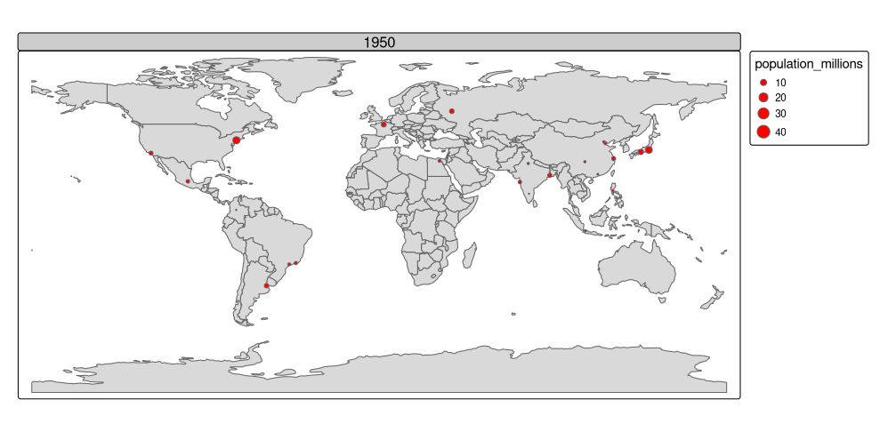

```{r}
library(sf)
library(terra)
library(dplyr)
library(spData)
library(spDataLarge)
```

```         
install.packages("tmap", repos = c("https://r-tmap.r-universe.dev",
                                   "https://cloud.r-project.org"))
```

```{r}
library(tmap)
library(leaflet)
library(ggplot2)
library(shiny)
```

```{r}
nz_elev <- rast(system.file("raster/nz_elev.tif", package = "spDataLarge"))
```

# Static maps

## tmap basics

```{r}
# Add fill layer to nz shape
tm_shape(nz) +
  tm_fill() 
# Add border layer to nz shape
tm_shape(nz) +
  tm_borders() 
# Add fill and border layers to nz shape
tm_shape(nz) +
  tm_fill() +
  tm_borders() 
```

## Map objects

```{r}
map_nz <- tm_shape(nz) + tm_polygons()
class(map_nz)
```

```{r}
map_nz1 <- map_nz +
  tm_shape(nz_elev) + tm_raster(col_alpha = 0.7)
```

```{r}
nz_water <- st_union(nz) |> 
  st_buffer(22200) |> 
  st_cast(to = "LINESTRING")
map_nz2 <- map_nz1 +
  tm_shape(nz_water) + tm_lines()
```

```{r}
map_nz3 <- map_nz2 + tm_symbols()
```

```{r}
#tmap_arrange(map_nz1, map_nz2, map_nz3)
```

```{r}
map_nz = tm_shape(nz) + tm_polygons()
class(map_nz)
#> [1] "tmap"
```

```{r}
map_nz1 = map_nz +
  tm_shape(nz_elev) + tm_raster(col_alpha = 0.7)
nz_water = st_union(nz) |>
  st_buffer(22200) |> 
  st_cast(to = "LINESTRING")
map_nz2 = map_nz1 +
  tm_shape(nz_water) + tm_lines()
map_nz3 = map_nz2 +
  tm_shape(nz_height) + tm_symbols()
```

```{r}
tmap_arrange(map_nz1, map_nz2, map_nz3)
```

## Visual variables

```{r}
ma1 = tm_shape(nz) + tm_polygons(fill = "red")
ma2 = tm_shape(nz) + tm_polygons(fill = "red", fill_alpha = 0.3)
ma3 = tm_shape(nz) + tm_polygons(col = "blue")
ma4 = tm_shape(nz) + tm_polygons(lwd = 3)
ma5 = tm_shape(nz) + tm_polygons(lty = 2)
ma6 = tm_shape(nz) + tm_polygons(fill = "red", fill_alpha = 0.3,
                                 col = "blue", lwd = 3, lty = 2)
tmap_arrange(ma1, ma2, ma3, ma4, ma5, ma6)
```

```{r}
ma1 = tm_shape(nz) + tm_polygons(fill = "red")
ma2 = tm_shape(nz) + tm_polygons(fill = "red", fill_alpha = 0.3)
ma3 = tm_shape(nz) + tm_polygons(col = "blue")
ma4 = tm_shape(nz) + tm_polygons(lwd = 3)
ma5 = tm_shape(nz) + tm_polygons(lty = 2)
ma6 = tm_shape(nz) + tm_polygons(fill = "red", fill_alpha = 0.3,
                                 col = "blue", lwd = 3, lty = 2)
tmap_arrange(ma1, ma2, ma3, ma4, ma5, ma6)
```

```{r}
plot(st_geometry(nz), col = nz$Land_area)
```

```{r}
tm_shape(nz) + tm_fill(fill = "Land_area")
```

```{r}
qtm(nz)
```

```{r}
qtm(nz) + qtm(nz_height)
```

## Scales

```{r}
tm_shape(nz) + tm_polygons(fill = "Median_income")
tm_shape(nz) + tm_polygons(fill = "Median_income",
                        fill.scale = tm_scale(breaks = c(0, 30000, 40000, 50000)))
tm_shape(nz) + tm_polygons(fill = "Median_income",
                           fill.scale = tm_scale(n = 10))
tm_shape(nz) + tm_polygons(fill = "Median_income",
                           fill.scale = tm_scale(values = "BuGn"))
```

`tm_scale_intervals()`

-   `style = "equal"`: divides input values into bins of equal range and is appropriate for variables with a uniform distribution (not recommended for variables with a skewed distribution as the resulting map may end-up having little color diversity)

-   `style = "quantile"`: ensures the same number of observations fall into each category (with the potential downside that bin ranges can vary widely)

-   `style = "jenks"`: identifies groups of similar values in the data and maximizes the differences between categories

-   `style = "log10_pretty"`: a common logarithmic (the logarithm to base 10) version of the regular pretty style used for variables with a right-skewed distribution

```{r}
tm_shape(nz) +
  tm_polygons(fill = "Median_income",
              fill.scale = tm_scale_intervals(style = "equal"))
```

```{r}
tm_shape(nz) +
  tm_polygons(fill = "Median_income",
              fill.scale = tm_scale_intervals(style = "jenks"))
```

```{r}
tm_shape(nz) +
  tm_polygons(fill = "Median_income", 
              fill.scale = tm_scale_continuous(n = 5)) +
  tm_title('tm_scale_continuous()', fontfamily = "monospace")
```

## Palettes

Palettes define the color ranges associated with the bins and determined by the tm_scale\_\*() functions, and its breaks and n arguments described above. It expects a vector of colors or a new color palette name, which can be find interactively with cols4all::c4a_gui(). You can also add a - as the color palette name prefix to reverse the palette order.

```{r}
tm_shape(nz) + 
  tm_polygons("Median_income", fill.scale = tm_scale(values = "greens"))
tm_shape(nz) + 
  tm_polygons("Median_income", fill.scale = tm_scale(values = "yl_gn_bu"))
```

```{r}
tm_shape(nz) + 
  tm_polygons("Median_income",
              fill.scale = tm_scale_continuous(values = "pu_gn_div", 
                                               midpoint = 28000))
```

## Legends

```{r}
legend_title <- expression("Area (km"^2*")")
tm_shape(nz) +
  tm_polygons(fill = "Land_area",
              fill.legend = tm_legend(title = legend_title))
```

The default legend orientation in tmap is "portrait", however, an alternative legend orientation, "landscape", is also possible. Other than that, we can also customize the location of the legend using the position argument.

```{r}
tm_shape(nz) +
  tm_polygons(fill = "Land_area",
              fill.legend = tm_legend(title = legend_title,
                                      orientation = "landscape",
                                      position = tm_pos_out("center", "bottom")))
```

## Layouts

```{r}
map_nz +
  tm_graticules() +
  tm_compass(type = "8star", position = c("left", "top")) +
  tm_scalebar(breaks = c(0, 100, 200),
              text.size = 1,
              position = c("left", "top")) +
  tm_title("New Zealand")
```

```{r}
map_nz + tm_layout(scale = 4)
map_nz + tm_layout(bg.color = "lightblue")
map_nz + tm_layout(frame = FALSE)
```

-   Margin settings including inner.margin and outer.margin
-   Font settings controlled by fontface and fontfamily
-   Legend settings including options such as legend.show (whether or not to show the legend) legend.orientation, legend.position, and legend.frame
-   Frame width (frame.lwd) and an option to allow double lines (frame.double.line)
-   Color settings controlling color.sepia.intensity (how yellowy the map looks) and color.saturation (a color-grayscale)

```{r}
map_nz + tm_layout(bg.color = "lightblue", color.sepia.intensity = 0.5)
```

## Faceted maps

```{r}
urb_1970_2030 <- urban_agglomerations |> 
  filter(year %in% c(1970, 1990, 2010, 2030))
```

```{r}
tm_shape(world) +
  tm_polygons() +
  tm_shape(urb_1970_2030) +
  tm_symbols(fill = "black", col = "white", size = "population_millions") +
  tm_facets_wrap(by = "year", nrow = 2)
```

## Inset maps

```{r}
nz_region <- st_bbox(c(xmin = 1340000, xmax = 1450000,
                       ymin = 5130000, ymax = 5210000),
                     crs = st_crs(nz_height)) |> 
  st_as_sfc()
```

```{r}
nz_height_map <- tm_shape(nz_elev, bbox = nz_region) +
  tm_raster(col.scale = tm_scale_continuous(values = "YlGn"),
            col.legend = tm_legend(position = c("left", "top"))) +
  tm_shape(nz_height) + tm_symbols(shape = 2, col = "red", size = 1) +
  tm_scalebar(position = c("left", "bottom"))
```

```{r}
nz_map <- tm_shape(nz) + tm_polygons() +
  tm_shape(nz_height) + tm_symbols(shape = 2, col = "red", size = 0.1) +
  tm_shape(nz_region) + tm_borders(lwd = 3) +
  tm_layout(bg.color = "lightblue")
```

One of the main differences between regular charts (e.g., scatterplots) and maps is that the input data determine the aspect ratio of maps. Thus, in this case, we need to calculate the aspect ratios of our two main datasets, nz_region and nz. The following function, norm_dim() returns the normalized width ("w") and height ("h") of the object (as "snpc" units understood by the graphic device).

```{r}
library(grid)
```

```{r}
norm_dim = function(obj){
    bbox = st_bbox(obj)
    width = bbox[["xmax"]] - bbox[["xmin"]]
    height = bbox[["ymax"]] - bbox[["ymin"]]
    w = width / max(width, height)
    h = height / max(width, height)
    return(unit(c(w, h), "snpc"))
}
```

```{r}
main_dim <- norm_dim(nz_region)
ins_dim <- norm_dim(nz)
```

Next, knowing the aspect ratios, we need to specify the sizes and locations of our two maps – the main map and the inset map – using the viewport() function. A viewport is part of a graphics device we use to draw the graphical elements at a given moment. The viewport of our main map is just the representation of its aspect ratio.

```{r}
main_vp <- viewport(width = main_dim[1], height = main_dim[2])
```

On the other hand, the viewport of the inset map needs to specify its size and location. Here, we would make the inset map twice smaller as the main one by multiplying the width and height by 0.5, and we will locate it 0.5 cm from the bottom right of the main map frame.

```{r}
ins_vp <- viewport(width = ins_dim[1] * 0.5, height = ins_dim[2] * 0.5,
                   x = unit(1, "npc") - unit(0.5, "cm"),
                   y = unit(0.5, "cm"),
                   just = c("right", "bottom"))
```

```{r}
grid.newpage()
print(nz_height_map, vp = main_vp)
pushViewport(main_vp)
print(nz_map, vp = ins_vp)
```

### US with Hawaii and Alaska

```{r}
us_states_map <- tm_shape(us_states, crs = "EPSG:9311") +
  tm_polygons() +
  tm_layout(frame = FALSE)
```

```{r}
hawaii_map <- tm_shape(hawaii) +
  tm_polygons() +
  tm_title("Hawaii") +
  tm_layout(frame = FALSE, bg.color = NA,
            title.position = c("LEFT", "BOTTOM"))
alaska_map <- tm_shape(alaska) +
  tm_polygons() +
  tm_title("Alaska") +
  tm_layout(frame = FALSE, bg.color = NA)
```

```{r}
us_states_map
print(hawaii_map, vp = grid::viewport(0.35, 0.1, width = 0.2, height = 0.1))
print(alaska_map, vp = grid::viewport(0.15, 0.15, width = 0.3, height = 0.3))
```

# Animated maps

```{r}
urb_anim <- tm_shape(world) + tm_polygons() +
  tm_shape(urban_agglomerations) + tm_symbols(size = "population_millions",
                                              fill = "red") +
  tm_facets_wrap(by = "year", nrow = 1, ncol = 1, free.coord = FALSE)
```

```{r}
tmap_animation(urb_anim, filename = "urb_anim.gif", delay = 25)
```



# Interactive maps

With tmap

```{r}
tmap_mode("view")
map_nz
```

```{r}
map_nz + tm_basemap(server = "OpenTopoMap")
```

An impressive and little-known feature of tmap’s view mode is that it also works with faceted plots. The argument sync in tm_facets_wrap() can be used in this case to produce multiple maps with synchronized zoom and pan settings, as illustrated in Figure 9.18, which was produced by the following code:

```{r}
world_coffee <- left_join(world, coffee_data, by = "name_long")
facets <- c("coffee_production_2016", "coffee_production_2017")
```

```{r}
tm_shape(world_coffee) + tm_polygons(facets) +
  tm_facets_wrap(nrow = 1, sync = TRUE)
```

```{r}
tmap_mode("plot")
```

### Mapview

```{r}
mapview::mapview(nz)
```

```{r}
library(mapview)
oberfranken <- subset(franconia, district == "Oberfranken")
```

```{r}
trails |> 
  st_transform(st_crs(oberfranken)) |> 
  st_intersection(oberfranken) |> 
  st_collection_extract("LINESTRING") |> 
  mapview(color = "red", lwd = 3, layer.name = "trails") +
  mapview(franconia, zcol = "district") +
  breweries
```


### Mapdeck

```{r}
library(mapdeck)
```

```{r}
set_token(Sys.getenv("MAPBOX"))
crash_data <- read.csv("https://git.io/geocompr-mapdeck")
crash_data <- na.omit(crash_data)
ms <- mapdeck_style("dark")
mapdeck(style = ms, pitch = 45, location = c(0, 52), zoom = 4) |> 
  add_grid(data = crash_data, lat = "lat", lon = "lng", cell_size = 1000,
           elevation_scale = 50, colour_range = hcl.colors(6, "plasma"))
```


```{r}
library(mapdeck)
set_token(Sys.getenv("MAPBOX"))
crash_data = read.csv("https://git.io/geocompr-mapdeck")
crash_data = na.omit(crash_data)
ms = mapdeck_style("dark")
mapdeck(style = ms, pitch = 45, location = c(0, 52), zoom = 4) |>
  add_grid(data = crash_data, lat = "lat", lon = "lng", cell_size = 1000,
           elevation_scale = 50, colour_range = hcl.colors(6, "plasma"))
```

```{r}
data(lnd)
mapdeck(style = ms, pitch = 45, location = c(0, 52), zoom = 5) |>
  add_grid(data = crash_data, lat = "lat", lon = "lng", cell_size = 1000,
           elevation_scale = 50, colour_range = hcl.colors(6, "plasma")) |> 
  add_polygon(data = lnd, layer_id = "polygon_layer")
```

### Leaflet


```{r}
pal = colorNumeric("RdYlBu", domain = cycle_hire$nbikes)
leaflet(data = cycle_hire) |> 
  addProviderTiles(providers$CartoDB.Positron) |>
  addCircles(col = ~pal(nbikes), opacity = 0.9) |> 
  addPolygons(data = lnd, fill = FALSE) |> 
  addLegend(pal = pal, values = ~nbikes) |> 
  setView(lng = -0.1, 51.5, zoom = 12) |> 
  addMiniMap()
```

# Other mapping packages

## Plot

```{r}
g = st_graticule(nz, lon = c(170, 175), lat = c(-45, -40, -35))
plot(nz_water, graticule = g, axes = TRUE, col = "blue")
terra::plot(nz_elev / 1000, add = TRUE, axes = FALSE)
plot(st_geometry(nz), add = TRUE)
```

## ggplot

```{r}
library(ggplot2)
g1 <- ggplot() +
  geom_sf(data = nz, aes(fill = Median_income)) +
  geom_sf(data = nz_height) +
  scale_x_continuous(breaks = c(170, 175))
g1
```

```{r}
plotly::ggplotly(g1)
```

```{r}
library(ggspatial)
ggplot() +
  layer_spatial(nz_elev) +
  geom_sf(data = nz, fill = NA) +
  annotation_scale() +
  scale_x_continuous(breaks = c(170, 175)) +
  scale_fill_continuous(na.value = NA)
```

## cartogram

A cartogram is a map in which the geometry is proportionately distorted to represent a mapping variable. 

```{r}
library(cartogram)
nz_carto <- cartogram_cont(nz, "Median_income", itermax = 5)
tm_shape(nz_carto) + tm_polygons("Median_income")
```

```{r}
us_states9311 <- st_transform(us_states, "EPSG:9311")
us_states9311_ncont <- cartogram_ncont(us_states9311, "total_pop_15")
```

```{r}
plot(us_states9311_ncont["NAME"])
```

```{r}
us_states9311_dorling <- cartogram_dorling(us_states9311, "total_pop_15")
plot(us_states9311_dorling["NAME"])
```


