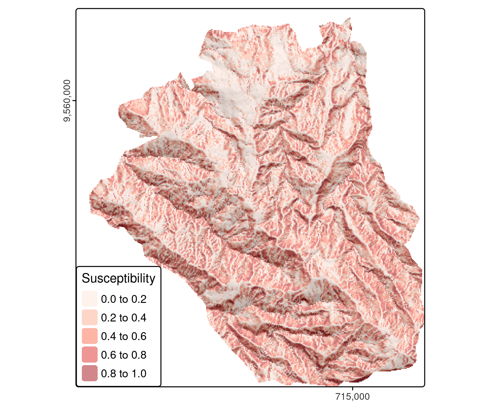

```{r setup, include=FALSE}
knitr::opts_chunk$set(echo = TRUE)
```

```{r}
library(sf)
library(terra)
library(dplyr)
library(future)
library(lgr)
library(mlr3)
library(mlr3learners)
library(mlr3extralearners)
library(mlr3spatiotempcv)
library(mlr3tuning)
library(mlr3viz)
library(progressr)
```

# Introduction

This chapter is based on a case study: modeling the occurrence of landslides. This application links to the applied nature of geocomputation, defined in Chapter 1, and illustrates how machine learning borrows from the field of statistics when the sole aim is prediction. Therefore, this chapter first introduces modeling and cross-validation concepts with the help of a Generalized Linear Model (A. Zuur et al. 2009). Building on this, the chapter implements a more typical machine learning algorithm, namely a Support Vector Machine (SVM). The models’ predictive performance will be assessed using spatial cross-validation (CV), which accounts for the fact that geographic data is special.

# Landslide susceptibility

```{r}
data("lsl", "study_mask", package = "spDataLarge")
ta <- terra::rast(system.file("raster/ta.tif", package = "spDataLarge"))
```

-   `lsl`: a `data.frame` containing `lslpts` with TRUE for an observed event
-   `study_mask`: an `sf` object
-   `ta`: a `SpatRaster` with terrain attributes


```{r}
head(lsl, 3) |> print.AsIs()
```

To model landslide susceptibility, we need some predictors. Since terrain attributes are frequently associated with landsliding ([Muenchow, Brenning, and Richter 2012](https://r.geocompx.org/references#ref-muenchow_geomorphic_2012)), we have already extracted following terrain attributes from `ta` to `lsl`:

-   `slope`: slope angle (°)
-   `cplan`: plan curvature (rad m^−1^) expressing the convergence or divergence of a slope and thus water flow
-   `cprof`: profile curvature (rad m^-1^) as a measure of flow acceleration, also known as downslope change in slope angle
-   `elev`: elevation (m a.s.l.) as the representation of different altitudinal zones of vegetation and precipitation in the study area
-   `log10_carea`: the decadic logarithm of the catchment area (log10 m^2^) representing the amount of water flowing towards a location

# Conventional modeling

```{r}
fit <- glm(lslpts ~ slope + cplan + cprof + elev + log10_carea,
           family = binomial(),
           data = lsl)
```

```{r}
class(fit)
```

```{r}
fit
```

```{r}
summary(fit)
```

```{r}
pred_glm <- predict(object = fit, type = "response")
head(pred_glm)
```

```{r}
pred <- terra::predict(ta, model = fit, type = "response")
```



Spatial distribution mapping is one very important outcome of a model (Figure [12.2](https://r.geocompx.org/spatial-cv#fig:lsl-susc)). Even more important is how good the underlying model is at making them since a prediction map is useless if the model’s predictive performance is bad. One of the most popular measures to assess the predictive performance of a binomial model is the Area Under the Receiver Operator Characteristic Curve (AUROC). This is a value between 0.5 and 1.0, with 0.5 indicating a model that is no better than random and 1.0 indicating perfect prediction of the two classes. Thus, the higher the AUROC, the better the model’s predictive power. The following code chunk computes the AUROC value of the model with `roc()`, which takes the response and the predicted values as inputs. `auc()` returns the area under the curve.

```{r}
pROC::auc(pROC::roc(lsl$lslpts, fitted(fit)))
```

# Spacial cross-validation

The ‘first law’ of geography states that points close to each other are, generally, more similar than points further away.

## `mlr3` stages

1.  **task**: Specify the data, response and predictor variables and model type
2.  **learner**: Define the learning algorithm
3.  **resampling**: Assess predictive performance

## Generalized linear model

The first essential argument of these `as_task_` functions is `backend`. `backend` expects that the input data includes the response and predictor variables. The `target` argument indicates the name of a response variable (in our case this is `lslpts`) and positive determines which of the two factor levels of the response variable indicate the landslide initiation point (in our case this is TRUE).

**Create task**

This failed

```         
task <- mlr3spatiotempcv::as_task_classif_st(
  id = "ecuador_lsl",
  backend = mlr3::as_data_backend(lsl),
  target = "lslpts",
  postive = "TRUE",
  coordinate_names = c("x", "y"),
  coords_as_features = FALSE,
  crs = "EPSG:32717"
)
```

```{r}
task = mlr3spatiotempcv::as_task_classif_st(
  mlr3::as_data_backend(lsl), 
  "lslpts", 
  id = "ecuador_lsl",
  positive = "TRUE",
  coordinate_names = c("x", "y"),
  coords_as_features = FALSE,
  crs = "EPSG:32717"
  )
```

```{r}
task = mlr3spatiotempcv::as_task_classif_st(
  id = "ecuador_lsl",
  x = mlr3::as_data_backend(lsl), 
  target = "lslpts", 
  positive = "TRUE",
  coordinate_names = c("x", "y"),
  coords_as_features = FALSE,
  crs = "EPSG:32717"
  )
```


```{r}
mlr3viz::autoplot(task, type = "duo")
```

```{r message=FALSE}
mlr3viz::autoplot(task, type = "pairs")
```

**Learner**

```{r}
mlr3extralearners::list_mlr3learners(
  filter = list(class = "classif", properties = "twoclass"), 
  select = c("id", "mlr3_package", "required_packages"))
```

```{r}
# 2. Specify learner
learner <- mlr3::lrn("classif.log_reg", predict_type = "prob")
```

```{r}
learner$help()
```

**specify resampling**

```{r}
resampling <- mlr3::rsmp("repeated_spcv_coords",
                         folds = 5, repeats = 100)
```

To execute the spatial resampling, we run [`resample()`](https://rspatial.github.io/terra/reference/resample.html) using the previously specified task, learner, and resampling strategy. This takes some time (around 15 seconds on a modern laptop) because it computes 500 resampling partitions and 500 models. As performance measure, we again choose the AUROC. To retrieve it, we use the `score()` method of the resampling result output object (`score_spcv_glm`). This returns a `data.table` object with 500 rows – one for each model.

```{r}
# reduce verbosity
lgr::get_logger("mlr3")$set_threshold("warn")
rr_spcv_glm <- mlr3::resample(task = task,
                              learner = learner,
                              resampling = resampling)
# Compute AUROC as a data.table
score_spcv_glm <- rr_spcv_glm$score(measure = mlr3::msr("classif.auc"))
# Keep needed columns
score_spcv_glm <- dplyr::select(score_spcv_glm, task_id, learner_id,
                                resampling_id, classif.auc)
```

```{r}
mean(score_spcv_glm$classif.auc) |> 
  round(2)
```

```         
score[, resampling_id := as.factor(resampling_id) |>
        forcats::fct_recode("conventional CV" = "repeated_cv", 
                            "spatial CV" = "repeated_spcv_coords") |> 
            forcats::fct_rev()]
library(ggplot2)
# rename the levels of resampling_id
score[, resampling_id := as.factor(resampling_id) |>
        forcats::fct_recode("conventional CV" = "repeated_cv", 
                            "spatial CV" = "repeated_spcv_coords") |> 
            forcats::fct_rev()]
# create the boxplot
ggplot2::ggplot(data = score[learner_id == "classif.log_reg"], 
                mapping = ggplot2::aes(x = resampling_id, y = classif.auc)) +
  ggplot2::geom_boxplot(fill = c("lightblue2", "mistyrose2")) +
  ggplot2::theme_bw() +
  ggplot2::labs(y = "AUROC", x = "")
```

## Spatial tuning of hyperparameters

This section introduces support vector machines (SVM) for prediction

Some SVM implementations such as that provided by kernlab allow hyperparameters to be tuned automatically, usually based on random sampling (see upper row of Figure 12.3). This works for non-spatial data but is of less use for spatial data where ‘spatial tuning’ should be undertaken

Of the options, we will use ksvm() from the kernlab package (Karatzoglou et al. 2004). To allow for non-linear relationships, we use the popular radial basis function (or Gaussian) kernel ("rbfdot") which is also the default of ksvm(). Setting the type argument to "C-svc" makes sure that ksvm() is solving a classification task. To make sure that the tuning does not stop because of one failing model, we additionally define a fallback learner.

```{r}
lrn_ksvm <- mlr3::lrn("classif.ksvm", predict_type = "prob",
                      kernel = "rbfdot", type = "C-svc")
lrn_ksvm$fallback <- lrn("classif.featureless", predict_type = "prob")
```

```{r}
perf_level <- mlr3::rsmp("repeated_spcv_coords", folds = 5, repeats = 100)
```

The random selection of values C and Sigma is additionally restricted to a predefined tuning space (search_space object). The range of the tuning space was chosen with values recommended in the literature (Schratz et al. 2019). To find the optimal hyperparameter combination, we fit 50 models (terminator object in the code chunk below) in each of these subfolds with randomly selected values for the hyperparameters C and Sigma.

```{r}
# create spatially disjoint partitions
tune_level <- mlr3::rsmp("spcv_coords", folds = 5)
# outer limits of randomly selected hyperparameters
search_space <- paradox::ps(
  C = paradox::p_dbl(lower = -12, upper = 15, trafo = function(x) 2^x),
  sigma = paradox::p_dbl(lower = -15, upper = 6, trafo = function(x) 2^x)
)
# use 50 randomly selected hyperparameters
terminator <- mlr3tuning::trm("evals", n_evals = 50)
tuner <- mlr3tuning::tnr("random_search")
```

```{r}
at_ksvm <- mlr3tuning::auto_tuner(
  learner = lrn_ksvm,
  resampling = tune_level,
  measure = mlr3::msr("classif.auc"),
  search_space = search_space,
  terminator = terminator,
  tuner = tuner
)
```

**paralellization**

```{r}
library(future)
future::plan(list("sequential", "multisession"),
             workers = floor(availableCores() / 2))
```

Before running the subsequent code, be aware that it is time-consuming since it will run the spatial cross-validation with 125,500 models. It can easily run for half a day on a modern laptop. Note that runtime depends on many aspects: CPU speed, the selected algorithm, the selected number of cores and the dataset.

```         
progressr::with_progress(expr = {
  rr_spcv_svm = mlr3::resample(task = task,
                               learner = at_ksvm, 
                               # outer resampling (performance level)
                               resampling = perf_level,
                               store_models = FALSE,
                               encapsulate = "evaluate")
})
# stop parallelization
future:::ClusterRegistry("stop")
# compute the AUROC values
score_spcv_svm = rr_spcv_svm$score(measure = mlr3::msr("classif.auc")) 
# keep only the columns you need
score_spcv_svm = dplyr::select(score_spcv_svm, task_id, learner_id, 
                               resampling_id, classif.auc)
```

```{r}
score = readRDS("./data/12-bmr_score.rds")
score_spcv_svm = dplyr::filter(score, learner_id == "classif.ksvm.tuned", 
                               resampling_id == "repeated_spcv_coords")
```

```{r}
round(mean(score_spcv_svm$classif.auc), 2)
```


