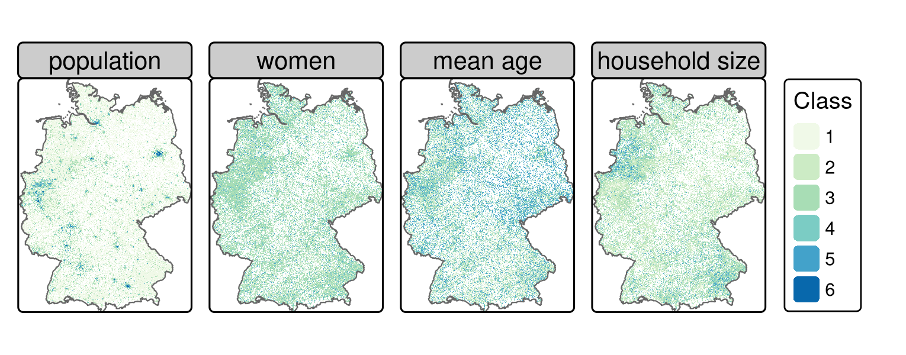
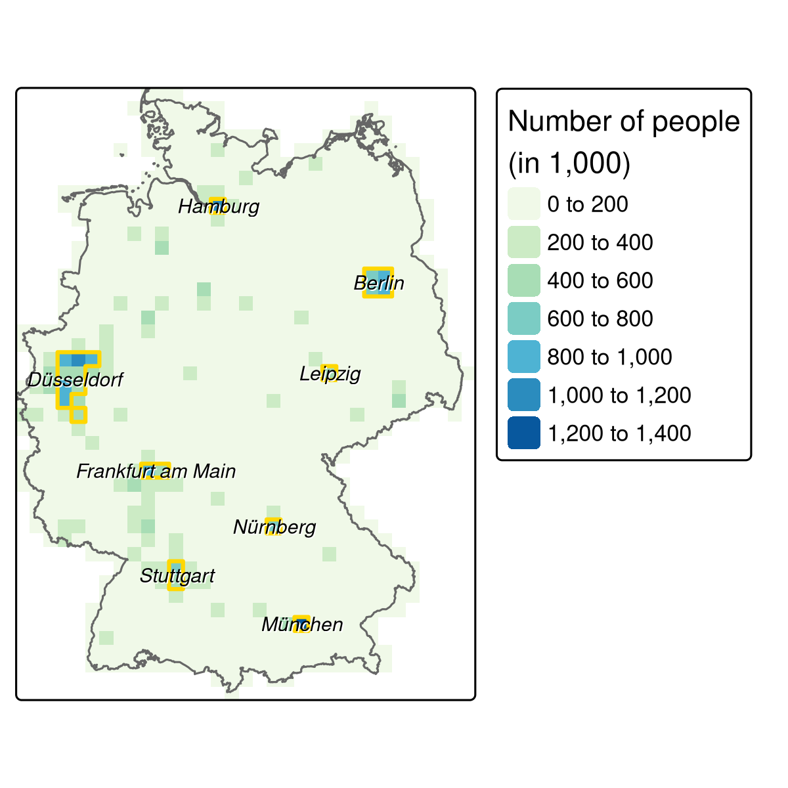

```{r}
library(sf)
library(dplyr)
library(purrr)
library(terra)
library(osmdata)
library(spDataLarge)
```

# Introduction

Typical research questions include:

-   Where do target groups live and which areas do they frequent?
-   Where are competing stores or services located?
-   How many people can easily reach specific stores?
-   Do existing services over- or under-utilize the market potential?
-   What is the market share of a company in a specific area?

# Case study: bike shops in Germany

The following sections will demonstrate how the techniques learned during the first chapters of the book can be applied to undertake common steps in service location analysis:

-   Tidy the input data from the German census (Section [14.3](https://r.geocompx.org/location#tidy-the-input-data))
-   Convert the tabulated census data into raster objects (Section [14.4](https://r.geocompx.org/location#create-census-rasters))
-   Identify metropolitan areas with high population densities (Section [14.5](https://r.geocompx.org/location#define-metropolitan-areas))
-   Download detailed geographic data (from OpenStreetMap, with **osmdata**) for these areas (Section [14.6](https://r.geocompx.org/location#points-of-interest))
-   Create rasters for scoring the relative desirability of different locations using map algebra (Section [14.7](https://r.geocompx.org/location#identifying-suitable-locations))

# Tidy the input data

The German government provides gridded census data at either 1 km or 100 m resolution. The following code chunk downloads, unzips and reads in the 1 km data.

```{r eval=FALSE}
download.file("https://tinyurl.com/ybtpkwxz",
              destfile = "census.zip", mode = "wb")
unzip("census.zip")
census_de <- readr::read_csv2(list.files(pattern = "Gitter.csv"))
```

```{r}
data("census_de", package = "spDataLarge")
```


```{r}
census_de
```

The `census_de` object is a data frame containing 13 variables for more than 360,000 grid cells across Germany. For our work, we only need a subset of these: Easting (`x`) and Northing (`y`), number of inhabitants (population; `pop`), mean average age (`mean_age`), proportion of women (`women`) and average household size (`hh_size`). These variables are selected and renamed from German into English in the code chunk below and summarized in Table [14.1](https://r.geocompx.org/location#tab:census-desc). Further, [`mutate()`](https://dplyr.tidyverse.org/reference/mutate.html) is used to convert values -1 and -9 (meaning “unknown”) to `NA`.

```{r}
input <- select(census_de, x = x_mp_1km, y = y_mp_1km, pop = Einwohner,
                women = Frauen_A, mean_age = Alter_D, hh_size = HHGroesse_D)
input_tidy <- mutate(input, 
                     across(.cols = c(pop, women, mean_age, hh_size),
                            .fns = ~ ifelse(.x %in% c(-1, -9), NA, .x)))
```

```
# pop = population, hh_size = household size
input = select(census_de, x = x_mp_1km, y = y_mp_1km, pop = Einwohner,
                      women = Frauen_A, mean_age = Alter_D, hh_size = HHGroesse_D)
# set -1 and -9 to NA
input_tidy = mutate(input, across(.cols = c(pop, women, mean_age, hh_size), 
                                  .fns =  ~ifelse(.x %in% c(-1, -9), NA, .x)))
```

# Create census rasters

After the preprocessing, the data can be converted into a `SpatRaster` object (see Sections [2.3.4](https://r.geocompx.org/spatial-class#raster-classes) and [3.3.1](https://r.geocompx.org/attr#raster-subsetting)) with the help of the [`rast()`](https://rspatial.github.io/terra/reference/rast.html) function. When setting its `type` argument to `xyz`, the `x` and `y` columns of the input data frame should correspond to coordinates on a regular grid. All the remaining columns (here: `pop`, `women`, `mean_age`, `hh_size`) will serve as values of the raster layers (Figure [14.1](https://r.geocompx.org/location#fig:census-stack); see also `code/14-location-figures.R` in our GitHub repository).

```
input_ras = rast(input_tidy, type = "xyz", crs = "EPSG:3035")
```

```{r}
input_ras <- rast(input_tidy, type = "xyz", crs = "EPSG:3035")
input_ras
```

> Note that we are using an equal-area projection (EPSG:3035; Lambert Equal Area Europe), i.e., a projected CRS\index{CRS!projected} where each grid cell has the same area, here 1000 x 1000 square meters. Since we are using mainly densities such as the number of inhabitants or the portion of women per grid cell, it is of utmost importance that the area of each grid cell is the same to avoid 'comparing apples and oranges'. Be careful with geographic CRS\index{CRS!geographic} where grid cell areas constantly decrease in poleward directions (see also Section \@ref(crs-intro) and Chapter \@ref(reproj-geo-data)).



```{r}
tab = dplyr::tribble(
  ~"class", ~"pop", ~"women", ~"age", ~"hh",
  1, "3-250", "0-40", "0-40", "1-2", 
  2, "250-500", "40-47", "40-42", "2-2.5",
  3, "500-2000", "47-53", "42-44", "2.5-3",
  4, "2000-4000", "53-60", "44-47", "3-3.5",
  5, "4000-8000", ">60", ">47", ">3.5",
  6, ">8000", "", "", ""
)
tab
```

## Reclassification

```{r eval=FALSE}
# uses the midpoint of each range
rcl_pop <- matrix(c(1, 1, 127,
                    2, 2, 375,
                    3, 3, 1250,
                    4, 4, 3000,
                    5, 5, 6000,
                    6, 6, 8000), ncol = 3, byrow = TRUE)

rcl_women <- matrix(c(1, 1, 3,
                      2, 2, 2,
                      3, 3, 1,
                      4, 5, 0), ncol = 3, byrow = TRUE)
rcl_age <- matrix(c(1, 1, 3,
                    2, 2, 0,
                    3, 5, 0), ncol = 3, byrow = TRUE)
rcl_hh <- rcl_women
rcl <- list(rcl_pop, rcl_women, rcl_age, rcl_hh)
```

```{r}
rcl_pop = matrix(c(1, 1, 127, 2, 2, 375, 3, 3, 1250, 
                   4, 4, 3000, 5, 5, 6000, 6, 6, 8000), 
                 ncol = 3, byrow = TRUE)
rcl_women = matrix(c(1, 1, 3, 2, 2, 2, 3, 3, 1, 4, 5, 0), 
                   ncol = 3, byrow = TRUE)
rcl_age = matrix(c(1, 1, 3, 2, 2, 0, 3, 5, 0),
                 ncol = 3, byrow = TRUE)
rcl_hh = rcl_women
rcl = list(rcl_pop, rcl_women, rcl_age, rcl_hh)
```


```
reclass = input_ras
for (i in seq_len(nlyr(reclass))) {
  reclass[[i]] = classify(x = reclass[[i]], rcl = rcl[[i]], right = NA)
}
names(reclass) = names(input_ras)
```

```{r}
reclass <- input_ras
for (i in seq_len(nlyr(reclass))) {
  reclass[[i]] = classify(x = reclass[[i]], rcl = rcl[[i]], right = NA)
}
names(reclass) = names(input_ras)
```

```{r}
reclass
```

# Define metropolitan areas

We deliberately define metropolitan areas as pixels of 20 km2 inhabited by more than 500,000 people. Pixels at this coarse resolution can rapidly be created using aggregate(), as introduced in Section 5.3.3. The command below uses the argument fact = 20 to reduce the resolution of the result twenty-fold (recall the original raster resolution was 1 km2).

```
pop_agg = aggregate(reclass$pop, fact = 20, fun = sum, na.rm = TRUE)
summary(pop_agg)
```

```{r}
pop_agg <- aggregate(reclass$pop, fact = 20, fun = sum, na.rm = TRUE)
summary(pop_agg)
```

Keep only cells with population \> 500k

```
pop_agg = pop_agg[pop_agg > 500000, drop = FALSE] 
```

```{r}
pop_agg <- pop_agg[pop_agg > 500000, drop = FALSE]
```

```
metros = pop_agg |> 
  patches(directions = 8) |>
  as.polygons() |>
  st_as_sf()
```


```{r}
metros <- pop_agg |> 
  patches(directions = 8) |> 
  as.polygons() |> 
  st_as_sf()
```



```         
tm_2 = tm_shape(pop_agg/1000) +
  tm_raster(col.scale = tm_scale(values = "GnBu"),
            col.legend = tm_legend(title = "Number of people\n(in 1,000)")) +
  tm_shape(ger) +
  tm_borders() +
  tm_shape(metros) +
  tm_borders(col = "gold", lwd = 2) +
  tm_shape(metros_points) +
  tm_text(text = "names", shadow = TRUE, size = 0.6,
          fontface = "italic") +
  tm_layout(legend.position = tm_pos_auto_out())

tmap_save(tm_2, "figures/14_metro_areas.png", width = 4, height = 4)
```

```{r eval=FALSE}
ger <-  geodata::gadm(country = "DEU", level = 0, path = tempdir())
ger <- st_as_sf(terra::project(ger, crs(input_ras)))
```

```{r eval=FALSE}
metros_points = st_centroid(metros)
```

```{r eval=FALSE}
library(tmap)
tm_2 = tm_shape(pop_agg/1000) +
  tm_raster(col.scale = tm_scale(values = "GnBu"),
            col.legend = tm_legend(title = "Number of people\n(in 1,000)")) +
  tm_shape(ger) +
  tm_borders() +
  tm_shape(metros) +
  tm_borders(col = "gold", lwd = 2) +
  tm_shape(metros_points) +
  tm_text(text = "names", shadow = TRUE, size = 0.6,
          fontface = "italic") +
  tm_layout(legend.position = tm_pos_auto_out())
```

```{r eval=FALSE}
tm_2
```

```
metro_names = sf::st_centroid(metros, of_largest_polygon = TRUE) |>
  tmaptools::rev_geocode_OSM(as.data.frame = TRUE) |>
  select(city, town, state)
# smaller cities are returned in column town. To have all names in one column,
# we move the town name to the city column in case it is NA
metro_names = dplyr::mutate(metro_names, city = ifelse(is.na(city), town, city))
```

```{r}
metro_names <- sf::st_centroid(metros, of_largest_polygon = TRUE) |> 
  tmaptools::rev_geocode_OSM(as.data.frame = TRUE) |> 
  select(city, town, state)
metro_names <- dplyr::mutate(metro_names, city = ifelse(is.na(city), town, city))
```

Ensure same data as example
```{r}
data("metro_names", package = "spDataLarge")
```


```{r}
metro_names
```

```{r}
metro_names <- metro_names$city |> 
  as.character() |>
  {\(x) ifelse(x == "Velbert", "Düsseldorf", x)}() |>
  {\(x) gsub("ü", "ue", x)}()
```

```{r}
# library(tmap)
# tm_2 = tm_shape(pop_agg/1000) +
  # tm_raster(col.scale = tm_scale(values = "GnBu"),
            # col.legend = tm_legend(title = "Number of people\n(in 1,000)")) +
  # tm_shape(ger) +
  # tm_borders() +
  # tm_shape(metros) +
  # tm_borders(col = "gold", lwd = 2) +
  # tm_shape(metros_points) +
  # tm_text(text = "metro_names$city", shadow = TRUE, size = 0.6,
          # fontface = "italic") +
  # tm_layout(legend.position = tm_pos_auto_out())
```

```{r}
# tm_2
```

# Points of interest

The **osmdata** package provides easy-to-use access to OSM data (see also Section [8.5](https://r.geocompx.org/read-write#retrieving-data)). Instead of downloading shops for the whole of Germany, we restrict the query to the defined metropolitan areas, reducing computational load and providing shop locations only in areas of interest. The subsequent code chunk does this using a number of functions including:

-   [`map()`](https://purrr.tidyverse.org/reference/map.html) (the **tidyverse** equivalent of [`lapply()`](https://rdrr.io/r/base/lapply.html)), which iterates through all eight metropolitan names which subsequently define the bounding box in the OSM query function [`opq()`](https://docs.ropensci.org/osmdata/reference/opq.html) (see Section [8.5](https://r.geocompx.org/read-write#retrieving-data))

-   [`add_osm_feature()`](https://docs.ropensci.org/osmdata/reference/add_osm_feature.html) to specify OSM elements with a key value of `shop` (see [wiki.openstreetmap.org](https://wiki.openstreetmap.org/wiki/Map_Features) for a list of common key:value pairs)

-   [`osmdata_sf()`](https://docs.ropensci.org/osmdata/reference/osmdata_sf.html), which converts the OSM data into spatial objects (of class `sf`)

-   `while()`, which tries two more times to download the data if the download failed the first time^99^

```{r eval=FALSE}
shops = purrr::map(metro_names, function(x) {
  message("Downloading shops of: ", x, "\n")
  # give the server a bit time
  Sys.sleep(sample(seq(5, 10, 0.1), 1))
  query = osmdata::opq(x) |>
    osmdata::add_osm_feature(key = "shop")
  points = osmdata::osmdata_sf(query)
  # request the same data again if nothing has been downloaded
  iter = 3
  while (nrow(points$osm_points) == 0 && iter > 0) {
    points = osmdata_sf(query)
    iter = iter - 1
  }
  # return only the point features
  points$osm_points
})
```

```{r eval=FALSE}
# checking if we have downloaded shops for each metropolitan area
ind = purrr::map_dbl(shops, nrow) == 0
if (any(ind)) {
  message("There are/is still (a) metropolitan area/s without any features:\n",
          paste(metro_names[ind], collapse = ", "), "\nPlease fix it!")
}
```

```{r eval=FALSE}
# select only specific columns
shops = purrr::map_dfr(shops, select, osm_id, shop)
```

```{r}
data("shops", package = "spDataLarge")
```

The only thing left to do is to convert the spatial point object into a raster (see Section [6.4](https://r.geocompx.org/raster-vector#rasterization)). The `sf` object, `shops`, is converted into a raster having the same parameters (dimensions, resolution, CRS) as the `reclass` object. Importantly, the [`length()`](https://rdrr.io/r/base/length.html) function is used here to count the number of shops in each cell.

```{r}
shops <- sf::st_transform(shops, st_crs(reclass))
poi <- rasterize(x = shops, y = reclass, 
                 field = "osm_id", fun = "length")
```

Construct reclassification matrix

```{r}
# construct reclassification matrix
int = classInt::classIntervals(values(poi), n = 4, style = "fisher")
int = round(int$brks)
rcl_poi = matrix(c(int[1], rep(int[-c(1, length(int))], each = 2), 
                   int[length(int)] + 1), ncol = 2, byrow = TRUE)
rcl_poi = cbind(rcl_poi, 0:3)  
# reclassify
poi = classify(poi, rcl = rcl_poi, right = NA) 
names(poi) = "poi"
```

# Identifying suitable locations

The only steps that remain before combining all the layers are to add poi to the reclass raster stack and remove the population layer from it. 

```{r}
reclass <- reclass[[names(reclass) != "pop"]] |> 
  c(poi)
```

```{r}
result <- sum(reclass)
result
```


```{r}
library(leaflet)
# have a look at suitable bike shop locations in Berlin
berlin = metros[metro_names == "Berlin", ]
berlin_raster = crop(result, vect(berlin)) 
# summary(berlin_raster)
# berlin_raster
berlin_raster = berlin_raster[berlin_raster > 9, drop = FALSE]
leaflet::leaflet() |> 
  leaflet::addTiles() |>
  # addRasterImage so far only supports raster objects
  leaflet::addRasterImage(raster::raster(berlin_raster), colors = "darkgreen",
                          opacity = 0.8) |>
  leaflet::addLegend("bottomright", colors = c("darkgreen"), 
                     labels = c("potential locations"), title = "Legend")  
```

